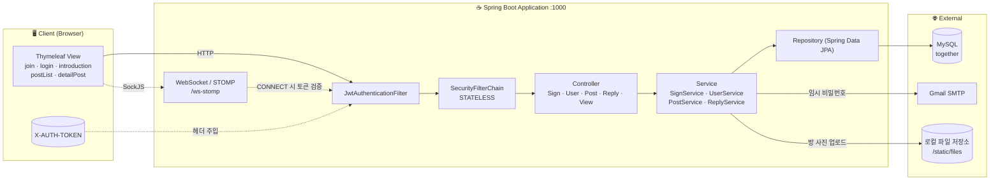
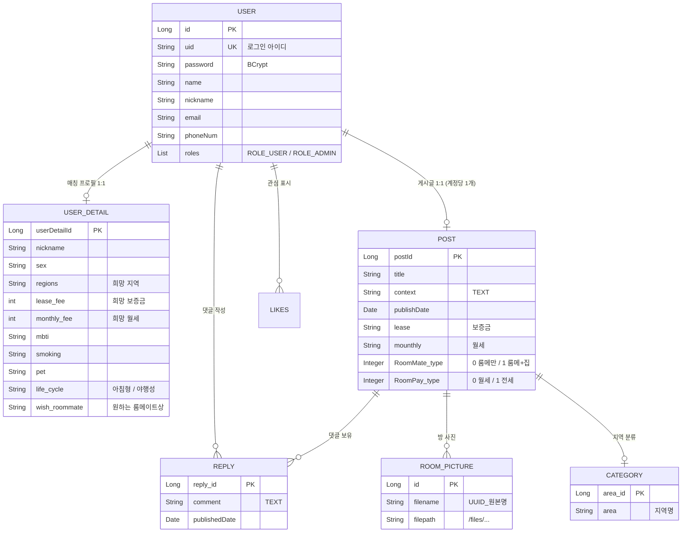
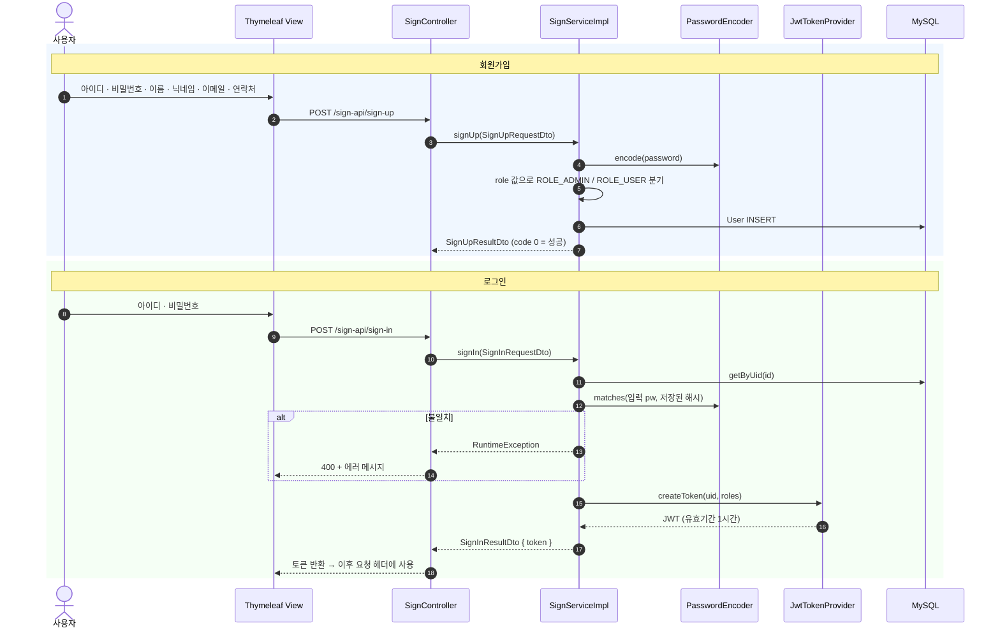
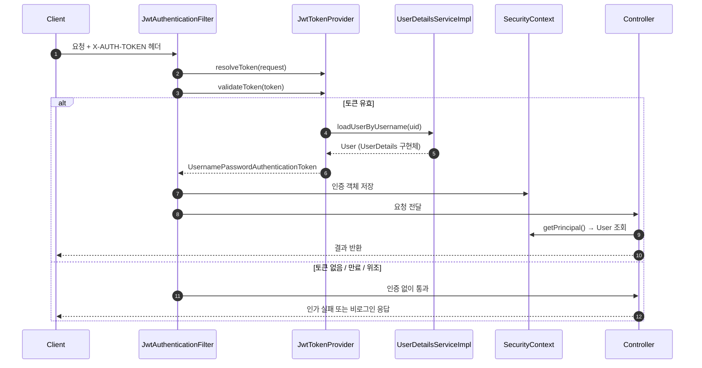
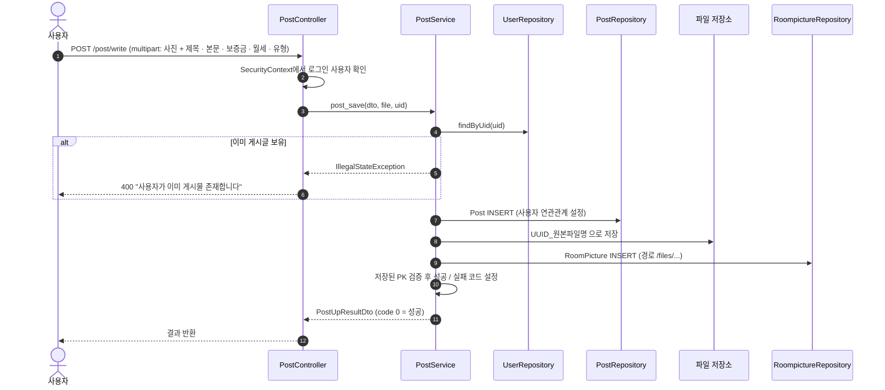
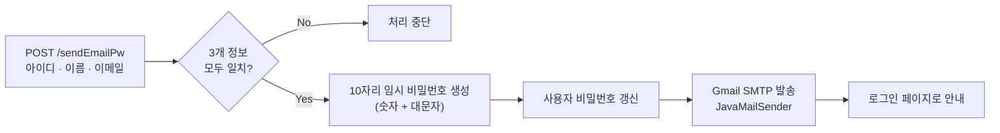

# 🏠 Togethers — 룸메이트 매칭 & 하우스 셰어링 플랫폼

> 1인 가구 증가와 주거비 부담 속에서, **"나와 생활 패턴이 맞는 룸메이트를 어떻게 찾을 것인가"** 를 해결하기 위해 시작한 **캡스톤 디자인 팀 프로젝트**입니다.
> 단순 게시판을 넘어 **MBTI · 생활 패턴 · 흡연 · 반려동물 · 희망 지역과 예산**을 프로필로 등록해 서로를 탐색하고, 방 사진과 함께 룸메이트 모집 글을 올릴 수 있는 웹 서비스입니다.

<p align="left">
  
  
  
  
  
  
  
  
</p>

---

## 📑 목차

| # | 항목 | 바로가기 |
|:---:|---|---|
| 1 | 프로젝트 개요 | [바로가기](#1-프로젝트-개요) |
| 2 | 팀 구성 | [바로가기](#2-팀-구성) |
| 3 | 주요 기능 | [바로가기](#3-주요-기능) |
| 4 | 기술 스택 | [바로가기](#4-기술-스택) |
| 5 | 시스템 아키텍처 | [바로가기](#5-시스템-아키텍처) |
| 6 | 프로젝트 구조 | [바로가기](#6-프로젝트-구조) |
| 7 | 데이터 모델 (ERD) | [바로가기](#7-데이터-모델-erd) |
| 8 | 핵심 동작 흐름 | [바로가기](#8-핵심-동작-흐름) |
| 9 | API 명세 | [바로가기](#9-api-명세) |
| 10 | 로컬 실행 방법 | [바로가기](#10-로컬-실행-방법) |
| 11 | 구현 포인트 | [바로가기](#11-구현-포인트) |
| 12 | 회고 — 한계와 배운 점 | [바로가기](#12-회고--한계와-배운-점) |
| 13 | 개선 계획 | [바로가기](#13-개선-계획) |

---

## 1. 프로젝트 개요

| 항목 | 내용 |
|---|---|
| **프로젝트명** | Togethers (룸메이트 매칭 플랫폼) |
| **개발 형태** | 캡스톤 디자인 **4인 팀 프로젝트** |
| **아키텍처** | Spring Boot 기반 **서버 사이드 렌더링(Thymeleaf) + REST API 혼합** |
| **인증 방식** | Spring Security + **JWT** (`X-AUTH-TOKEN` 헤더, 유효기간 1시간) |
| **데이터베이스** | MySQL 8 + Spring Data JPA (Hibernate) |
| **문서화** | Swagger 2.9.2 (`/swagger-ui.html`) |

### 이 프로젝트에서 다룬 것

- **도메인 모델링** — 사용자 · 매칭 프로필 · 게시글 · 사진 · 댓글 · 좋아요를 JPA 연관관계로 설계
- **Stateless 인증 파이프라인** — `JwtTokenProvider` → `JwtAuthenticationFilter` → `SecurityContext` → 컨트롤러
- **파일 업로드** — 방 사진을 UUID 기반 파일명으로 저장하고 게시글과 연관관계로 관리
- **외부 연동** — Gmail SMTP를 통한 임시 비밀번호 발송
- **실시간 통신 기반 마련** — STOMP + SockJS WebSocket 설정 및 핸드셰이크 단계 JWT 검증

---

## 2. 팀 구성

<p>
<a href="https://github.com/shyeon4643"></a>
<a href="https://github.com/Kor-YJ"></a>
<a href="https://github.com/bhcvanvanmumani"></a>
<a href="https://github.com/hokyun-tazo"></a>
</p>

| 팀원 | 담당 영역 |
|---|---|
| [@shyeon4643](https://github.com/shyeon4643) | BackEnd |
| [@Kor-YJ](https://github.com/Kor-YJ) | FrontEnd |
| [@bhcvanvanmumani](https://github.com/bhcvanvanmumani) | FrontEnd |
| [@hokyun-tazo](https://github.com/hokyun-tazo) | BackEnd, DataBase |

---

## 3. 주요 기능

| 구분 | 기능 | 설명 |
|---|---|---|
| **인증** | 회원가입 | `ROLE_USER` / `ROLE_ADMIN` 권한 분기, BCrypt 비밀번호 암호화 |
| | 로그인 | 아이디·비밀번호 검증 후 **JWT 발급** (`X-AUTH-TOKEN`, 1시간) |
| | 아이디 찾기 | 이름 + 휴대폰 번호 일치 검증 후 아이디 반환 |
| | 비밀번호 찾기 | 아이디·이름·이메일 3중 검증 → **10자리 임시 비밀번호 메일 발송** |
| **매칭 프로필** | 프로필 등록 / 수정 | 닉네임 · 성별 · 희망 지역 · 보증금 / 월세 · **MBTI** · 흡연 · 반려동물 · 생활 패턴(아침형/야행성) · 원하는 룸메이트상 |
| **게시글** | 작성 | 제목 · 본문 · 보증금 / 월세 · **방 사진 업로드**, 계정당 **1개만** 등록 가능 |
| | 목록 조회 | 최신순 페이징 (페이지당 8건) |
| | 상세 조회 | 게시글 + 방 사진 + 댓글 목록을 하나의 DTO로 조합해 반환 |
| | 수정 / 삭제 | **작성자 본인 검증** 후 처리, 삭제 시 사진·댓글 연쇄 삭제 |
| **댓글** | 작성 / 삭제 | 게시글에 댓글 작성, 삭제는 **작성자 본인만** 가능 |
| **실시간** | WebSocket 설정 | STOMP + SockJS 엔드포인트(`/ws-stomp`), CONNECT 시 JWT 검증 |

**게시글 유형 코드**

| 필드 | 값 | 의미 |
|---|:---:|---|
| `RoomMate_type` | `0` / `1` | 룸메이트만 구함 / 룸메이트 + 집을 함께 구함 |
| `RoomPay_type` | `0` / `1` | 월세 / 전세 |

---

## 4. 기술 스택

| 분류 | 기술 | 비고 |
|---|---|---|
| Language / Runtime | **Java 11**, Gradle | |
| Framework | **Spring Boot 2.7.5**, Spring MVC | |
| 인증 / 보안 | Spring Security, **JJWT 0.11.2**, BCrypt | `SessionCreationPolicy.STATELESS` |
| 영속성 | Spring Data JPA (Hibernate), MyBatis Starter | `ddl-auto: update` |
| DB | **MySQL 8** (`MySQL5InnoDBDialect`) | |
| View | **Thymeleaf** + Layout Dialect, Bootstrap | 서버 사이드 렌더링 |
| 실시간 | Spring WebSocket, **STOMP**, SockJS | 핸드셰이크 시 토큰 검증 |
| 메일 | Spring Boot Starter Mail (Gmail SMTP) | 임시 비밀번호 발송 |
| 문서화 | **Springfox Swagger 2.9.2** | `/swagger-ui.html` |
| 기타 | Lombok, Validation, DevTools | |

---

## 5. 시스템 아키텍처



---

## 6. 프로젝트 구조

```
CapStone_NSU
└── src/main
    ├── java/togethers/togethers
    │   ├── TogethersApplication.java
    │   ├── config/            # 보안 · 인증 · 인프라 설정
    │   │   ├── SecurityConfiguration.java      # 필터체인 · 인가 규칙
    │   │   ├── JwtTokenProvider.java           # 토큰 생성 / 검증 / 인증객체 변환
    │   │   ├── JwtAuthenticationFilter.java    # 요청당 1회 토큰 검사
    │   │   ├── WebSocketConfig.java            # STOMP + SockJS
    │   │   ├── StompHandler.java               # CONNECT 시 JWT 검증
    │   │   ├── SwaggerConfiguration.java
    │   │   └── CommonResponse.java             # 성공(0) / 실패(-1) 공통 코드
    │   ├── controller/        # Sign · User · Post · Reply · View · Test
    │   ├── service/           # SignServiceImpl · UserServiceImpl · PostService · ReplyService
    │   ├── repository/        # User · UserDetail · Post · Reply · Like · RoomPicture · Category
    │   ├── entity/            # User · UserDetail · Post · Reply · Like · RoomPicture · Category
    │   └── dto/               # Request / Result DTO (BaseResultDto 상속 구조)
    └── resources
        ├── application.yml
        ├── templates/         # Thymeleaf (member · post · find · fragments · layout)
        └── static/            # css · js · image · files(업로드 사진)
```

---

## 7. 데이터 모델 (ERD)



**설계 의도**

- 사용자와 게시글을 **1:1**로 묶어 *"한 사람이 하나의 모집 글만 운영한다"* 는 도메인 규칙을 스키마 레벨에서 표현했습니다. (중복 모집 글로 인한 리스트 오염 방지)
- 매칭 조건은 `USER`가 아닌 **`USER_DETAIL`로 분리**해, 로그인 정보와 매칭 프로필의 생명주기를 독립시켰습니다.
- 게시글 삭제 시 사진·댓글이 함께 정리되도록 `cascade` + `orphanRemoval`을 적용했습니다.

---

## 8. 핵심 동작 흐름

### 8-1. 회원가입 & 로그인 (JWT 발급)



### 8-2. 인증이 필요한 요청 처리



> **설계 의도:** `User` 엔티티가 직접 `UserDetails`를 구현하도록 해, 컨트롤러에서 `SecurityContext`의 principal을 그대로 도메인 객체로 사용할 수 있게 했습니다. 덕분에 **요청 파라미터의 사용자 ID를 신뢰하지 않고** 토큰에서 확인된 사용자만으로 권한을 판단합니다.

### 8-3. 게시글 작성 (이미지 업로드 + 1인 1게시물 규칙)



### 8-4. 비밀번호 찾기 (임시 비밀번호 메일 발송)



---

## 9. API 명세

**Base URL** — `http://localhost:1000`
**인증 헤더** — `X-AUTH-TOKEN: {JWT}` *(Bearer 스킴이 아닌 커스텀 헤더 사용)*

### 🔐 인증 `/sign-api`

| Method | Endpoint | 설명 | Request |
|:---:|---|---|---|
| `POST` | `/sign-api/sign-up` | 회원가입 | `id`, `password`, `name`, `role`, `nickname`, `email`, `phoneNum` |
| `POST` | `/sign-api/sign-in` | 로그인 (JWT 발급) | `id`, `pw` → `{ token }` |
| `GET` | `/sign-api/exception` | 예외 처리 테스트용 | — |

### 👤 사용자 / 매칭 프로필

| Method | Endpoint | 설명 | Request |
|:---:|---|---|---|
| `POST` | `/introduction` | 매칭 프로필 등록 | `nickname`, `gender`, `regions`, `lease_fee`, `monthly_fee`, `mbti`, `smoking`, `pet`, `life_cycle`, `wish_roommate` |
| `PATCH` | `/introduction/edit` | 매칭 프로필 수정 | 위와 동일 |
| `POST` | `/findId` | 아이디 찾기 | `name`, `phoneNum` |
| `POST` | `/sendEmailPw` | 임시 비밀번호 메일 발송 | `id`, `name`, `email` |
| `PATCH` | `/user/editPassword` | 비밀번호 변경 | `id`, `password` |

### 📝 게시글

| Method | Endpoint | 설명 | Request |
|:---:|---|---|---|
| `POST` | `/post/write` | 게시글 작성 (multipart) | `file`, `title`, `text`, `lease`, `mouthly`, `roomType`, `getType` |
| `GET` | `/post/postList` | 게시글 목록 (8건 페이징, 최신순) | `page` |
| `GET` | `/post/detailPost/{postId}` | 게시글 상세 (사진 · 댓글 포함) | `postId` |
| `GET` | `/post/modify` | 수정 화면 진입 | — |
| `PATCH` | `/post/modify` | 게시글 수정 (본인 검증) | `post_id`, `title`, `text`, `lease`, `mouthly`, `roomType`, `getType` |
| `POST` | `/post/delete` | 게시글 삭제 (본인 검증) | `PostId` |

### 💬 댓글

| Method | Endpoint | 설명 | Request |
|:---:|---|---|---|
| `POST` | `/detailPost/Reply` | 댓글 작성 | `post_id`, `comment` |
| `POST` | `/detailPost/ReplyDelete` | 댓글 삭제 (작성자 검증) | `PostId`, `ReplyId` |

### 🖥️ 뷰 라우팅

| Method | Endpoint | 렌더링 템플릿 |
|:---:|---|---|
| `GET` | `/sign-api/sign-up` | `join.html` |
| `GET` | `/sign-api/sign-in` | `member/login.html` |
| `GET` | `/introduction` | `member/introduction.html` |

**공통 응답 형식** — 모든 결과 DTO는 `BaseResultDto`를 상속해 아래 필드를 공통으로 가집니다.

```json
{ "success": true, "code": 0, "msg": "Success" }
```

---

## 10. 로컬 실행 방법

**사전 준비** — JDK 11 / MySQL 8 / Gradle

**1. 데이터베이스 생성**

```sql
CREATE DATABASE together DEFAULT CHARACTER SET utf8mb4;
```

**2. `src/main/resources/application.yml` 설정**

> ⚠️ 현재 저장소의 `application.yml`에는 DB 비밀번호와 메일 계정이 하드코딩되어 있습니다.
> 실행 전 **본인 환경 값으로 교체**하고, 운영 시에는 반드시 환경변수로 분리하세요. ([13. 개선 계획](#13-개선-계획) 참고)

```yaml
server:
  port: 1000
spring:
  datasource:
    url: jdbc:mysql://localhost:3306/together?serverTimezone=Asia/Seoul
    username: ${DB_USERNAME}
    password: ${DB_PASSWORD}
  mail:
    username: ${MAIL_USERNAME}
    password: ${MAIL_PASSWORD}
  jwt:
    secret: ${JWT_SECRET}
```

**3. 업로드 디렉터리 생성**

```bash
mkdir -p src/main/resources/static/files
```

**4. 실행**

```bash
./gradlew bootRun
```

- 접속: `http://localhost:1000/sign-api/sign-in`
- API 문서: `http://localhost:1000/swagger-ui.html`

---

## 11. 구현 포인트

<details>
<summary><b>1. 도메인 규칙을 연관관계로 표현하기 — "계정당 게시글 1개"</b></summary>

<br>

룸메이트 모집 특성상 한 사람이 여러 모집 글을 올리면 목록이 중복으로 오염됩니다. 이를 서비스 로직의 조건문으로만 막지 않고, **`User ↔ Post`를 1:1 연관관계로 설계**해 스키마 차원에서 규칙을 드러냈습니다. 저장 시에는 `user.getPost() != null` 검사로 `IllegalStateException`을 던지고, 컨트롤러의 `@ExceptionHandler`가 이를 사용자 메시지로 변환합니다.

</details>

<details>
<summary><b>2. 요청 값이 아닌 토큰에서 사용자 판별하기</b></summary>

<br>

게시글 수정·삭제, 댓글 삭제처럼 **소유권 검증이 필요한 기능**은 요청 파라미터로 받은 사용자 ID를 신뢰하면 타인의 데이터를 조작할 수 있습니다. `User` 엔티티가 `UserDetails`를 구현하도록 만들어 `SecurityContext`의 principal을 그대로 도메인 객체로 꺼내 쓰고, **토큰에서 확인된 사용자와 리소스 소유자가 일치할 때만** 처리되도록 했습니다.

</details>

<details>
<summary><b>3. 업로드 파일명 충돌 방지</b></summary>

<br>

사용자가 올린 방 사진은 원본 파일명이 겹칠 가능성이 높습니다. **`UUID + "_" + 원본파일명`** 으로 저장해 충돌을 막고, DB에는 실제 저장 파일명(`filename`)과 서비스 경로(`filepath`)를 분리 저장해 조회 시 경로 조합 없이 바로 렌더링할 수 있게 했습니다. 업로드 용량은 파일 10MB / 요청 20MB로 제한했습니다.

</details>

<details>
<summary><b>4. 성공 / 실패를 일관된 응답 코드로 반환</b></summary>

<br>

REST 응답이 기능마다 제각각인 문제를 줄이기 위해 `BaseResultDto`(success · code · msg)를 두고 모든 결과 DTO가 이를 상속하도록 했습니다. 서비스는 `CommonResponse.SUCCESS(0)` / `FAIL(-1)` 열거형으로 결과를 채워, 클라이언트가 **코드 값 하나로 분기**할 수 있게 했습니다.

</details>

<details>
<summary><b>5. WebSocket 핸드셰이크 단계의 인증</b></summary>

<br>

채팅 기능 확장을 위해 STOMP + SockJS를 구성하면서, 연결 이후가 아니라 **`StompCommand.CONNECT` 시점에 `ChannelInterceptor`로 JWT를 검증**하도록 했습니다. 인증되지 않은 소켓 연결 자체를 차단하는 구조입니다.

</details>

---

## 12. 회고 — 한계와 배운 점

캡스톤 기간 내에 **핵심 도메인(회원 · 매칭 프로필 · 게시글 · 댓글)은 동작하는 수준까지 완성**했지만, 부족한 점이 많았고 배운점도 많은 프로젝트 였습니다.

### 완성하지 못한 것

| 항목 | 현재 상태 |
|---|---|
| **채팅** | WebSocket / STOMP **설정과 인증 인터셉터까지만** 구현. 메시지 컨트롤러와 채팅 화면은 미구현 |
| **좋아요** | `Like` 엔티티와 연관관계는 설계했지만, 실제 저장은 게시글의 단일 `Boolean` 필드를 덮어쓰는 형태 — **사용자별 좋아요로 동작하지 않음** |
| **매칭 추천** | 프로필(MBTI · 생활 패턴 · 예산)은 수집하지만, 이를 이용한 **추천·필터 검색 기능까지 가지 못함**. 프로젝트의 원래 차별점이었던 만큼 가장 아쉬운 부분 |
| **테스트** | 컨텍스트 로드 테스트 1개뿐으로, 사실상 검증 자동화가 없음 |

### 코드를 다시 짠다면 고칠 것

1. **설정 파일에 비밀정보를 두지 않는다.** DB 비밀번호와 메일 계정이 `application.yml`에 그대로 커밋되어 있습니다. 당시에는 "로컬에서 돌아가면 된다"고 생각했지만, 공개 저장소에서는 그 자체가 사고입니다. 환경변수 또는 `application-local.yml` + `.gitignore`가 기본이어야 했습니다.
2. **비밀번호는 어떤 경로로든 반드시 암호화한다.** 임시 비밀번호 발급과 비밀번호 변경 경로에서 `PasswordEncoder`를 거치지 않고 평문을 저장하고 있습니다. 로그인 시 해시 비교를 하므로 **실제로 로그인이 되지 않는 버그**이기도 합니다. 암호화 지점을 서비스 곳곳에 흩어두지 말고 한 곳으로 모았어야 했습니다.
3. **인가 규칙과 컨트롤러 가정을 일치시킨다.** `/post/**`를 `permitAll`로 열어둔 채 컨트롤러는 로그인 사용자가 있다고 가정하고 principal을 캐스팅합니다. **"URL은 열려 있는데 코드는 닫혀 있다고 믿는"** 불일치로, 비로그인 요청 시 예외가 발생합니다.
4. **예외 처리를 전역으로 모은다.** 컨트롤러마다 `@ExceptionHandler`가 흩어져 있어 응답 형식이 통일되지 않았습니다. `@RestControllerAdvice` 하나로 모으고 도메인 예외를 정의했어야 했습니다.
5. **네이밍 규칙을 팀 차원에서 먼저 합의한다.** `postId` / `post_id`, `RoomMate_type` 같은 표기 혼용과 `mouthly`(monthly 오타) 같은 실수가 DB 컬럼명까지 굳어졌습니다. 컨벤션 합의는 개발 시작 **전에** 끝내야 하는 일이라는 걸 체감했습니다.

### 배운 것

- **팀 프로젝트에서 가장 비싼 비용은 "합의하지 않은 것"** 이었습니다. 네이밍, 응답 형식, 인증 방식 같은 규칙을 코드로 사전에 정의했다면 병합 과정의 혼선이 훨씬 적었을 것입니다.
- **기능 개수보다 완성도가 중요합니다.** 채팅·좋아요·매칭 추천을 모두 착수했지만 어느 것도 끝내지 못했습니다. 범위를 좁혀 **핵심 가치(매칭 추천) 하나를 끝까지** 완성하는 편이 결과물로서 훨씬 설득력 있었을 것입니다.


<div align="center">

**Togethers** — 룸메이트 매칭 & 하우스 셰어링 플랫폼

Capstone Design Team Project

</div>
